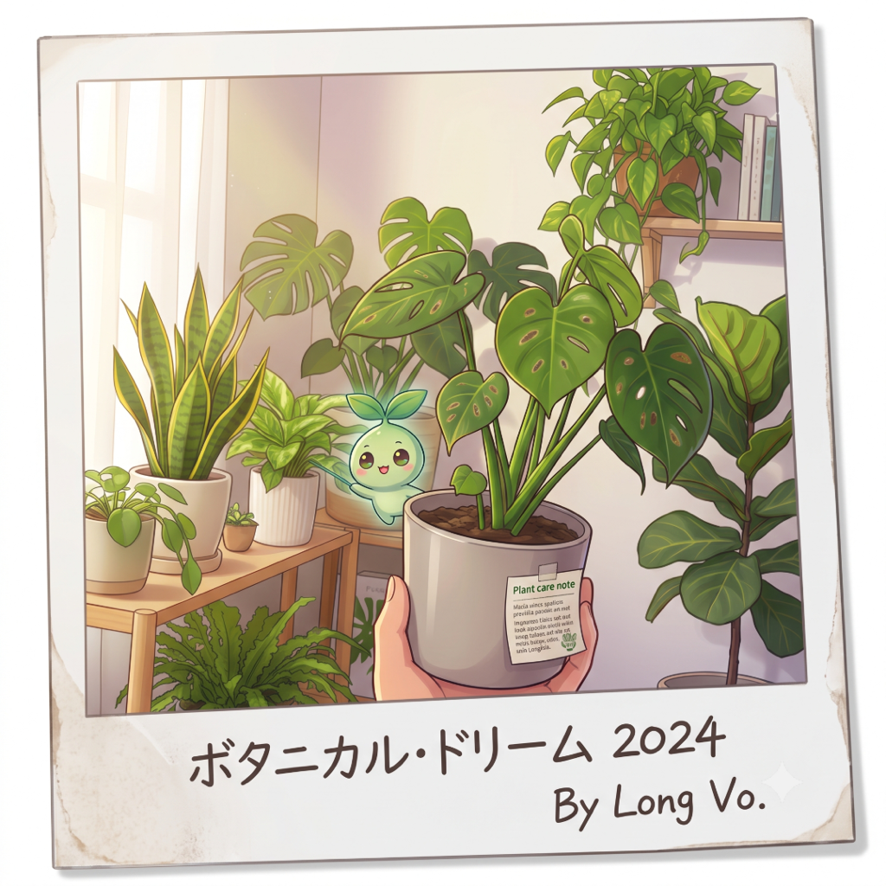
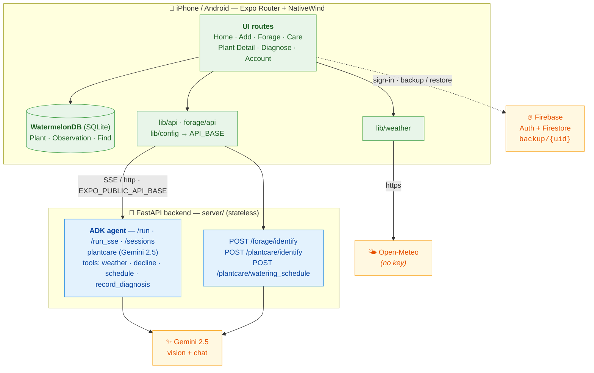

<div align="center">



# 🌿 Frondly

**Your friendly, AI-powered plant-care companion.**
_Snap a photo → get an agent diagnosis & care plan → watch each plant thrive._

<sub>*Frondly* = **frond** (a leaf) + **friendly**</sub>

<br/>

[](https://docs.expo.dev/versions/v56.0.0/)
[](https://reactnative.dev/)
[](https://www.python.org/)
[](https://fastapi.tiangolo.com/)
[](https://google.github.io/adk-docs/)
[](https://ai.google.dev/)
[](https://firebase.google.com/)
[](#-testing)
[](https://www.kaggle.com/)
[](#-kaggle-capstone-context)

</div>

---

## 🪴 The problem

Two everyday plant problems share one root cause — **not knowing what's wrong, when to act, or what's safe.**

- **At home:** people kill houseplants not from neglect but from uncertainty — is it over- or under-watered? Is that spot a fungus or sunburn? How often should _this_ plant, in _this_ room, be watered? Generic care tags don't answer that, and plant-ID apps stop at a name.
- **Outdoors:** foragers face a higher-stakes version of the same question — is this wild plant edible, or a toxic lookalike? Getting it wrong can be dangerous, and a bare species name is nowhere near enough to decide.

## 💡 The solution

**Frondly is a personal plant-care _and_ foraging concierge agent.** Point your camera at a plant and the agent:

- **Identifies** it (name + species) and prefills your garden entry.
- **Diagnoses** health from a photo, streaming back a plain-language explanation, a health score, and a care plan — and remembers the conversation so you can ask follow-ups.
- **Schedules watering** per plant using species, room, light, and live local weather — not a fixed calendar.
- **Forages safely** — identifies a plant in the wild with explicit edibility states and toxic-lookalike warnings (never a bare "it's edible"), always paired with a safety reminder.
- **Tracks** every plant and find on-device, with optional secure cloud backup.

> **Why an agent?** Plant care isn't one API call — it's *reasoning over messy visual input, then choosing the right tool*: identify vs. diagnose vs. compute a watering schedule vs. fetch weather. The `plantcare` ADK agent orchestrates those tools and holds context across a diagnosis conversation, which a static classifier can't do.

## 🎓 Kaggle capstone context

Built for the **Kaggle 5-Day AI Agents Intensive — Vibe Coding Capstone**, submitted to the **Concierge Agents** track ("planning a garden … agents that keep personal information safe and secure").

**Course concepts demonstrated (≥3 required):**

| Concept | How Frondly demonstrates it | Where |
|---|---|---|
| 🤖 **Agent system (ADK)** | `plantcare` ADK agent (Gemini 2.5) with tool-calling: diagnosis, watering schedule, weather, decline tracking; streamed over `/run_sse` | `server/plantcare/`, `server/main.py` |
| 🔒 **Security features** | Firebase email/password auth + **per-user Firestore rules** (a user can only read/write their own backup); local-first — data lives on-device by default | `client/firebase/firestore.rules`, `client/src/lib/{auth.tsx,firebase.ts}` |
| 🚀 **Deployability** | Stateless FastAPI backend (persists nothing) + Expo dev-build client; single `GEMINI_API_KEY`, no server DB to provision | `server/`, [Quickstart](#-quickstart) |

## 🏗️ Architecture

Local-first mobile client + a **stateless** agent backend. The device is the source of truth; the server holds no user data.



## ✨ Features

| Feature | What it does |
|---|---|
| 📸 **Plant identification** | Photo → name + species, prefilled into your garden (Gemini vision) |
| 🩺 **Diagnose flow** | Photo → streamed agent diagnosis, health score, care plan; saved as an observation; ask follow-ups in a thread |
| 💧 **Smart watering schedule** | Per-plant schedule from species + room + light + live weather; Care tab sorts soonest/overdue first |
| 🌤️ **Live weather card** | Open-Meteo + device location (30-min cache), shown in °C and °F |
| 🍃 **Forage Finds** | Identify plants in the wild, persist them, browse a species library |
| 📖 **Garden journal** | Per-plant history, growth timeline, tappable note cards |
| ☁️ **Secure cloud backup** | Firebase-auth-gated manual backup/restore of garden metadata to Firestore (per-user isolation) |

## 🚀 Quickstart

Monorepo: a Python agent backend (`server/`) and a React Native / Expo client (`client/`).

### 1. Backend (`server/`)

Requires [uv](https://docs.astral.sh/uv/) and a Google **`GEMINI_API_KEY`**.

```bash
# From the repo root — copy the template and add your Gemini key (loaded by server/main.py):
cp .env.example .env                             # then edit .env and set GEMINI_API_KEY=...

cd server
uv sync
uv run uvicorn main:app --reload                 # simulator → http://localhost:8000
# For a physical device, bind all interfaces so the phone can reach it over LAN:
# uv run uvicorn main:app --reload --host 0.0.0.0
```

### 2. Client (`client/`)

Requires Node + [yarn](https://yarnpkg.com/). WatermelonDB needs native modules, so use an Expo **development build** (not Expo Go).

```bash
cd client
yarn install
cp .env.example .env.local             # then edit .env.local (see below)

# Build & run on a connected physical device (prompts you to pick from your devices):
npx expo run:ios --device              # iOS — needs Xcode + a signing team; enable Developer Mode on the phone
npx expo run:android --device          # Android

# …or build a dev client in the cloud via EAS (no local Xcode needed):
# npx eas build --profile development --platform ios   # or android

yarn start                             # Metro dev server (once the dev build is installed)
```

**Configure `client/.env.local`:**

```bash
# Backend URL — defaults to http://localhost:8000 (simulator + adb-reverse).
# On a physical device, set your dev machine's LAN IP (find it with `ipconfig getifaddr en0`).
# The IP below is only an example — replace it with YOUR Mac's IP:
EXPO_PUBLIC_API_BASE=http://192.123.1.12:8000

# Firebase (free Spark plan) — only needed for cloud backup/restore.
# The app is fully usable signed-out; auth gates backup only.
EXPO_PUBLIC_FIREBASE_API_KEY=...
EXPO_PUBLIC_FIREBASE_AUTH_DOMAIN=your-project.firebaseapp.com
EXPO_PUBLIC_FIREBASE_PROJECT_ID=your-project
EXPO_PUBLIC_FIREBASE_APP_ID=...
```

### 3. (Optional) Enable cloud backup

Create a Firebase project (free Spark plan) → enable **Authentication ▸ Email/Password** → create a **Firestore Database** → paste the Web-app config into `client/.env.local` → publish the rules in `client/firebase/firestore.rules` (Firebase console ▸ Firestore ▸ Rules). No paid plan or Storage bucket required — backup is metadata-only.

## 🧪 Testing

```bash
cd client && yarn jest --forceExit    # 89 tests (14 suites)
cd server && uv run pytest            # backend tool + endpoint tests
```

## 🧰 Tech stack

| Layer | Tech |
|---|---|
| **Agent backend** | Python 3.14, FastAPI, **Google ADK 2.3**, **Gemini 2.5** (vision + chat), uv |
| **Client** | React Native 0.85 (Expo SDK 56), Expo Router, NativeWind (Tailwind v3), WatermelonDB (SQLite) |
| **Cloud / auth** | Firebase Auth + Firestore (free Spark plan) |
| **Data sources** | Open-Meteo (weather, no key) |
| **Tooling** | uv (server); yarn + ESLint + Prettier + Husky + Jest (client) |

## 📁 Repo structure

```
frondly-world/
├── server/    # FastAPI + Google ADK plantcare agent + Gemini vision (stateless)
├── client/    # Expo / React Native app — Expo Router + NativeWind + WatermelonDB
├── docs/      # Design specs, per-feature specs, and the project ROADMAP
└── README.md
```

Feature-by-feature status and the full design history live in [`docs/ROADMAP.md`](docs/ROADMAP.md).

## 📄 Notes

- **No secrets in the repo** — `GEMINI_API_KEY` and Firebase keys are read from gitignored `.env` / `.env.local`; only `.env.example` is committed.
- **Deployment is optional** for judging; this repo + the above setup instructions is the reproducible path. The backend is stateless and container-friendly if you do deploy it.

## 🗺️ Next milestones

Frondly is feature-complete for the capstone; these are the deliberate next steps to take it from "portfolio project" to "daily driver."

### 🔄 Sync & data
- **Live multi-device sync** — today's cloud feature is *manual* backup/restore (whole-garden replace). True sync means WatermelonDB pull/push endpoints on a stateful backend, with conflict resolution and background push — a real architectural shift from today's stateless server.
- **Auto-sync** — push changes on write (debounced) and pull on app-foreground, so a new phone or reinstall just works with no "restore" button.
- **Cloud photo backup** — photos are device-local today (metadata-only backup). Add content-hash dedup + a blob store (e.g. paid Firebase Storage or an S3-compatible bucket) so images survive a reinstall.
- **Backup history** — keep the last _N_ snapshots instead of overwriting one, enabling point-in-time restore.

### 🔐 Auth & security
- **OAuth / Google & Apple sign-in** — one-tap onboarding beyond email/password.
- **Password reset + email verification** — table stakes for a real account system.
- **Restore cleanup** — clear the temp/cache download dir after re-persisting photos into durable storage.

### 🔔 Engagement
- **Watering reminders** — local/push notifications driven by the per-plant schedule ("Monstera is due today").
- **Diagnosis persistence** — the diagnose thread is ephemeral (`useState`); persist conversations so follow-ups survive leaving the screen.

### 🚢 Platform & deploy
- **Production EAS build** — an EAS profile that bakes a production `EXPO_PUBLIC_API_BASE`; publish to TestFlight / Play internal testing.
- **Deploy the backend** — containerize the stateless FastAPI service to Cloud Run (or similar) with reproducible deploy docs.
- **EAS project ownership** — settle which Expo account owns builds so non-Mac teammates can produce iOS builds.
</content>
